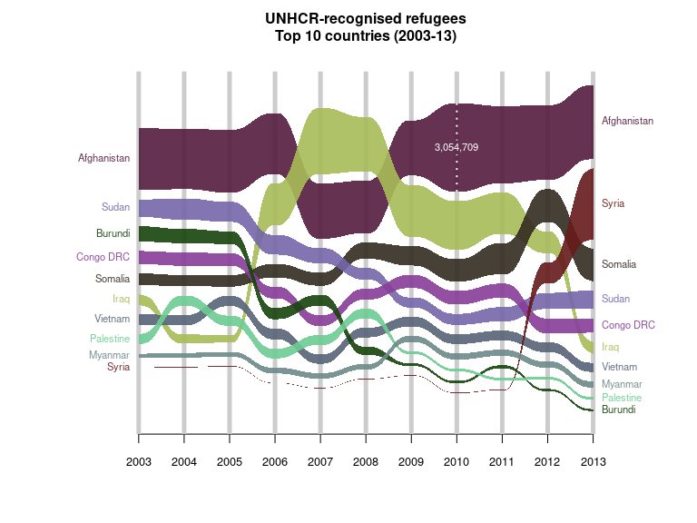

# R package for drawing alluvial diagrams

<!-- badges: start -->

[](https://github.com/mbojan/alluvial/actions)
[](http://cranlogs.r-pkg.org/)
[](https://cran.r-project.org/package=alluvial)
<!-- badges: end -->

What are alluvial diagrams? See for example:

-   [Wikipedia](http://en.wikipedia.org/wiki/Alluvial_diagram)
-   My [blog post](http://bc.bojanorama.pl/2014/03/alluvial-diagrams)
    showing-off this package
-   Some discussion on
    [CrossValidated](http://stats.stackexchange.com/questions/12029/is-it-possible-to-create-parallel-sets-plot-using-r)

## Examples

Alluvial diagram of `datasets::Titanic` data made with `alluvial()`.
Notice how each category block becomes a stacked barchart showing
relative frequency of survivors.

``` r
tit <- tibble::as_tibble(Titanic)

tit %>% head() %>% knitr::kable()
```

| Class | Sex    | Age   | Survived |   n |
|:------|:-------|:------|:---------|----:|
| 1st   | Male   | Child | No       |   0 |
| 2nd   | Male   | Child | No       |   0 |
| 3rd   | Male   | Child | No       |  35 |
| Crew  | Male   | Child | No       |   0 |
| 1st   | Female | Child | No       |   0 |
| 2nd   | Female | Child | No       |   0 |

``` r
alluvial(
    select(tit, Survived, Sex, Age, Class),
    freq=tit$n,
    col = ifelse(tit$Survived == "Yes", "orange", "grey"),
    border = ifelse(tit$Survived == "Yes", "orange", "grey"),
    layer = tit$Survived != "Yes",
    alpha = 0.8,
    blocks=FALSE
  )
```

<!-- -->

Alluvial diagram for multiple time series / cross-sectional data based
on `alluvial::Refugees` data made with `alluvial_ts()`.

``` r
Refugees %>% head() %>% knitr::kable()
```

| country     | year | refugees |
|:------------|-----:|---------:|
| Afghanistan | 2003 |  2136043 |
| Burundi     | 2003 |   531637 |
| Congo DRC   | 2003 |   453465 |
| Iraq        | 2003 |   368580 |
| Myanmar     | 2003 |   151384 |
| Palestine   | 2003 |   350568 |

``` r
set.seed(39) # for nice colours
cols <- hsv(h = sample(1:10/10), s = sample(3:12)/15, v = sample(3:12)/15)

alluvial_ts(Refugees, wave = .3, ygap = 5, col = cols, plotdir = 'centred', alpha=.9,
            grid = TRUE, grid.lwd = 5, xmargin = 0.2, lab.cex = .7, xlab = '',
            ylab = '', border = NA, axis.cex = .8, leg.cex = .7,
            leg.col='white', 
            title = "UNHCR-recognised refugees\nTop 10 countries (2003-13)\n")
```

<!-- -->

## Installation

Install stable version from CRAN using

``` r
install.packages("alluvial")
```

or development version from GitHub using `remotes::install_github()`:

``` r
remotes::install_github("mbojan/alluvial", build_vignettes=TRUE)
```
