# Creating Alluvial Diagrams

## What is alluvial diagram?

Alluvial diagram is a variant of a Parallel Coordinates Plot (PCP) but
for categorical variables. Variables are assigned to vertical axes that
are parallel. Values are represented with blocks on each axis.
Observations are represented with *alluvia* (sing. “alluvium”) spanning
across all the axes.

You create alluvial diagrams with function
[`alluvial()`](http://mbojan.github.io/alluvial/reference/alluvial.md).
Let us use `Titanic` dataset as an example. As it is a `table`, we need
to convert it to a data frame

``` r

tit <- as.data.frame(Titanic, stringsAsFactors = FALSE)
head(tit)
```

    ##   Class    Sex   Age Survived Freq
    ## 1   1st   Male Child       No    0
    ## 2   2nd   Male Child       No    0
    ## 3   3rd   Male Child       No   35
    ## 4  Crew   Male Child       No    0
    ## 5   1st Female Child       No    0
    ## 6   2nd Female Child       No    0

and create the alluvial diagram:

``` r

alluvial(
  tit[,1:4], 
  freq=tit$Freq,
  col = ifelse(tit$Survived == "Yes", "orange", "grey"),
  border = ifelse(tit$Survived == "Yes", "orange", "grey"),
  hide = tit$Freq == 0,
  cex = 0.7
)
```

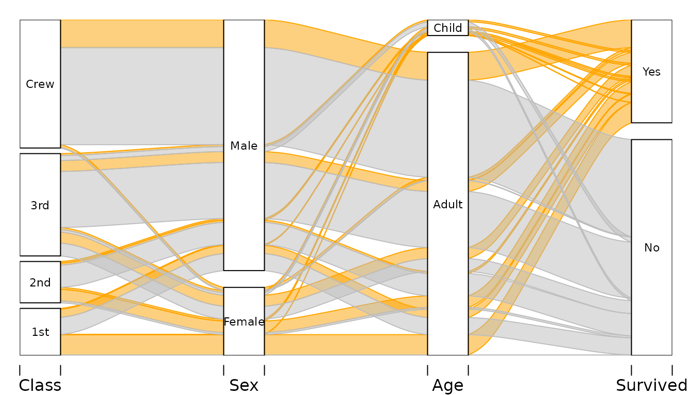

We have four variables:

- `Class` on the ship the passanger occupied
- `Sex` of the passenger
- `Age` of the passenger
- Whether the passenger `Survived`.

Vertical sizes of the blocks are proportional to the frequency, and so
are the widths of the alluvia. Alluvia represent all combinations of
values of the variables in the dataset. By default the vertical order of
the alluvia is determined by alphabetical ordering of the values on each
variable lexicographically (last variable changes first) drawn from
bottom to top. In this example, the color is determined by passengers’
survival status, i.e. passenger who survived are represented with orange
alluvia.

Alluvial diagrams are very useful in reading various conditional and
uncoditional distributions in a multivariate dataset. For example, we
can see that:

- Most of the Crew did not survived – majority of the height of the Crew
  category is covered by grey alluvia.
- Majortity of the Crew where adult men.
- Almost all women from the 1st Class did survive.
- The women who did not survive come mostly from 3rd class.

## Simple use

Minimal use requires supplying data frame(s) as first argument, and a
vector of frequencies as the `freq` argument. By default all alluvia are
drawn using mildly transparent gray.

Two variables `Class` and `Survived`:

``` r

# Survival status and Class
tit %>% group_by(Class, Survived) %>%
  summarise(n = sum(Freq)) -> tit2d
```

    ## `summarise()` has regrouped the output.
    ## ℹ Summaries were computed grouped by Class and Survived.
    ## ℹ Output is grouped by Class.
    ## ℹ Use `summarise(.groups = "drop_last")` to silence this message.
    ## ℹ Use `summarise(.by = c(Class, Survived))` for per-operation grouping
    ##   (`?dplyr::dplyr_by`) instead.

``` r

alluvial(tit2d[,1:2], freq=tit2d$n)
```


Three variables `Sex`, `Class`, and `Survived`:

``` r

# Survival status, Sex, and Class
tit %>% group_by(Sex, Class, Survived) %>%
  summarise(n = sum(Freq)) -> tit3d
```

    ## `summarise()` has regrouped the output.
    ## ℹ Summaries were computed grouped by Sex, Class, and Survived.
    ## ℹ Output is grouped by Sex and Class.
    ## ℹ Use `summarise(.groups = "drop_last")` to silence this message.
    ## ℹ Use `summarise(.by = c(Sex, Class, Survived))` for per-operation grouping
    ##   (`?dplyr::dplyr_by`) instead.

``` r

alluvial(tit3d[,1:3], freq=tit3d$n)
```

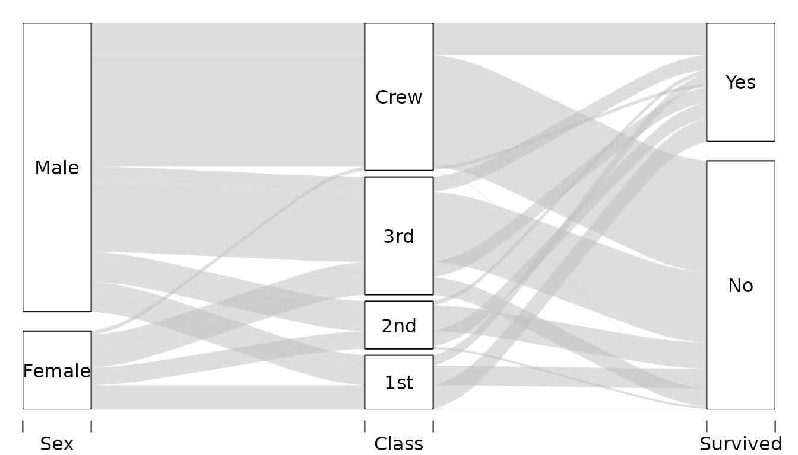

## Customizing

There are several ways to customize alluvial diagrams with
[`alluvial()`](http://mbojan.github.io/alluvial/reference/alluvial.md)
the following sections illustrate probably most common usecases.

### Customizing colors

Colors of the alluvia can be customized with `col`, `border` and `alpha`
arguments. For example:

``` r

alluvial(
  tit3d[,1:3], 
  freq=tit3d$n,
  col = ifelse( tit3d$Sex == "Female", "pink", "lightskyblue"),
  border = "grey",
  alpha = 0.7,
  blocks=FALSE
)
```

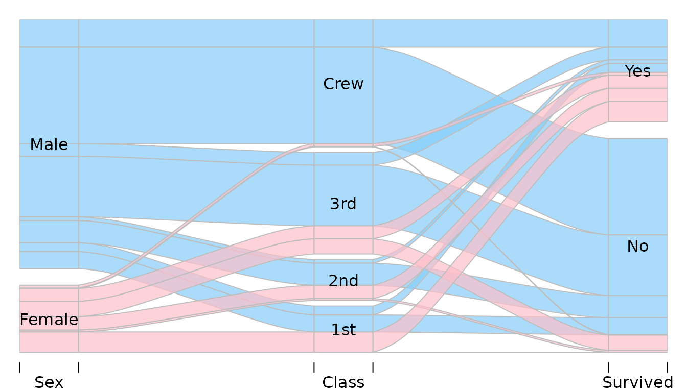

### Hiding and reordering alluvia

#### Hiding

With `alluvial` sometimes it is desirable to omit plotting of some of
the alluvia. This is most frequently the case with larger datasets in
which there are a lot of combinations of values of the variables
associated with very small frequencies, or even 0s. Alluvia can be
hidden with argument `hide` expecting a logical vector of length equal
to the number of rows in the data. Alluvia for which `hide` is `FALSE`
are not plotted. For example, to hide alluvia with frequency less than
150:

``` r

alluvial(tit2d[,1:2], freq=tit2d$n, hide=tit2d$n < 150)
```


This skips drawing the alluvia corresponding to the following rows in
`tit` data frame:

``` r

tit2d %>% select(Class, Survived, n) %>%
  filter(n < 150)
```

    ## # A tibble: 2 × 3
    ## # Groups:   Class [2]
    ##   Class Survived     n
    ##   <chr> <chr>    <dbl>
    ## 1 1st   No         122
    ## 2 2nd   Yes        118

You can see the gaps e.g. on the “Yes” and “No” category blocks on the
`Survived` axis.

If you would rather omit these rows from the plot alltogether (i.e. no
gaps), you need to filter your data before it is used by
[`alluvial()`](http://mbojan.github.io/alluvial/reference/alluvial.md).

#### Changing “layers”

By default alluvia are plotted in sequence determined by the row order
in the dataset. It determines which alluvia will be plotted “on top” of
which others.

Consider simple data:

``` r

d <- data.frame(
  x = c(1, 2, 3),
  y = c(3 ,2, 1),
  freq=c(1,1,1)
)
d
```

    ##   x y freq
    ## 1 1 3    1
    ## 2 2 2    1
    ## 3 3 1    1

As there are three rows, we will have three alluvia:

``` r

alluvial(d[,1:2], freq=d$freq, col=1:3, alpha=1)
# Reversing the order
alluvial(d[ 3:1, 1:2 ], freq=d$freq, col=3:1, alpha=1)
```


Note that to keep colors matched in the same way to the alluvia we had
to reverse the `col` argument too. Instead of reordering the data and
keeping track of the other arguments plotting order can be adjusted with
`layer` argument:

``` r

alluvial(d[,1:2], freq=d$freq, col=1:3, alpha=1, 
         layer=3:1)
```

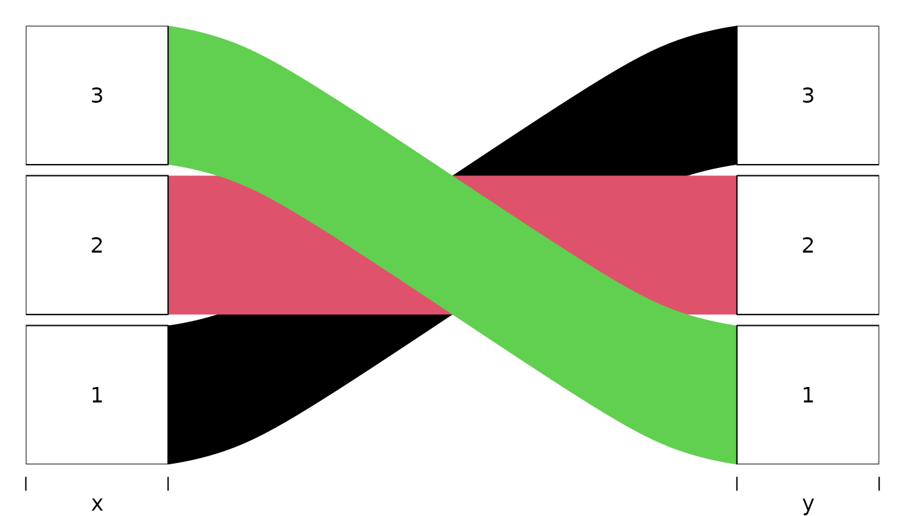

The value of `layer` is passed to `order` so it is possible to use
logical vectors e.g. if you only want to put some of the flows on top.
For example, for Titanic data to put all alluvia for all survivors on
top we can:

``` r

alluvial(tit3d[,1:3], freq=tit3d$n, 
         col = ifelse( tit3d$Survived == "Yes", "orange", "grey" ),
         alpha = 0.8,
         layer = tit3d$Survived == "No"
)
```

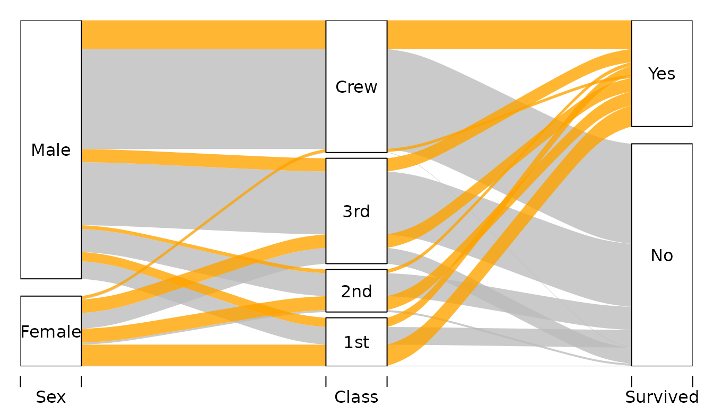

First layer is the one on top, second layer below the first and so on.
Consequently, in the example above, `Survived == "No"` is ordered after
`Survived == "Yes"` so the former is below the latter.

#### Adjusting vertical order of categories

By default
[`alluvial()`](http://mbojan.github.io/alluvial/reference/alluvial.md)
orders the values on each axis in an alphabetic order. This happens
irrespectively of the ordering of observations in the plotted dataset.
It is possible to override the default ordering by transforming the
variables of interest into `factor`s with a custom ordering of levels.

Consider the following example data:

``` r

d <- data.frame(
  col = c("#A6CEE3", "#1F78B4", "#B2DF8A", "#33A02C", "#FB9A99", 
          "#E31A1C", "#FDBF6F", "#FF7F00"), # from RColorBrewer Paired palette
  Temperature = rep(c("cool", "hot"), each=4),
  Luminance = rep(c("bright", "dark"), 4),
  Color = rep(c("blue", "green", "red", "orange"), each=2)
) %>%
  mutate(
    n = 1
  )
d
```

    ##       col Temperature Luminance  Color n
    ## 1 #A6CEE3        cool    bright   blue 1
    ## 2 #1F78B4        cool      dark   blue 1
    ## 3 #B2DF8A        cool    bright  green 1
    ## 4 #33A02C        cool      dark  green 1
    ## 5 #FB9A99         hot    bright    red 1
    ## 6 #E31A1C         hot      dark    red 1
    ## 7 #FDBF6F         hot    bright orange 1
    ## 8 #FF7F00         hot      dark orange 1

Plotting it with
[`alluvial()`](http://mbojan.github.io/alluvial/reference/alluvial.md)
with default settings will give:

``` r

alluvial(
  select(d, Temperature, Luminance, Color),
  freq=d$n,
  col = d$col,
  alpha=0.9
)
```

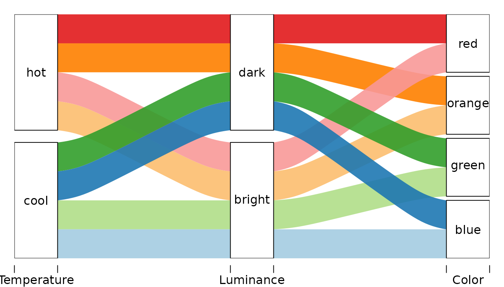

Let’s change the order of categories of:

- the `Color` axis such that it is (from the bottom): green, blue,
  orange, red.
- the `Luminance` axis such that it is reversed.

For each variable we create a factor with a vector of unique values of
that variable sorted the way we want passed to `levels` argument of
[`factor()`](https://rdrr.io/r/base/factor.html):

``` r

d <- d %>%
  mutate(
    Color_f = factor(Color, levels=c("green", "blue", "red", "orange")),
    Luminance_f = factor(Luminance, levels=c("dark", "bright"))
  )
```

… and plot

``` r

alluvial(
  select(d, Temperature, Luminance_f, Color_f),
  freq=d$n,
  col = d$col,
  alpha=0.9
)
```

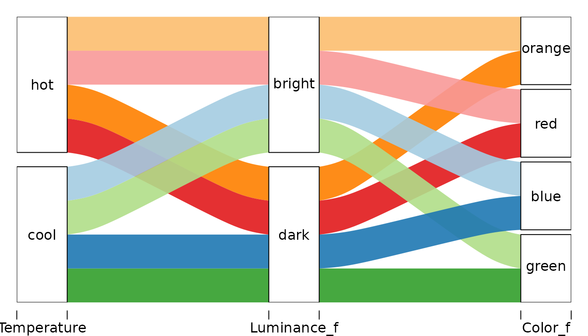

Another version recognizing that in data `Color` is nested in
`Temperature`. Different axis order gives clearer picture of the data
structure.

``` r

alluvial(
  select(d, Temperature, Color_f, Luminance_f),
  freq=d$n,
  col = d$col,
  alpha=0.9
)
```

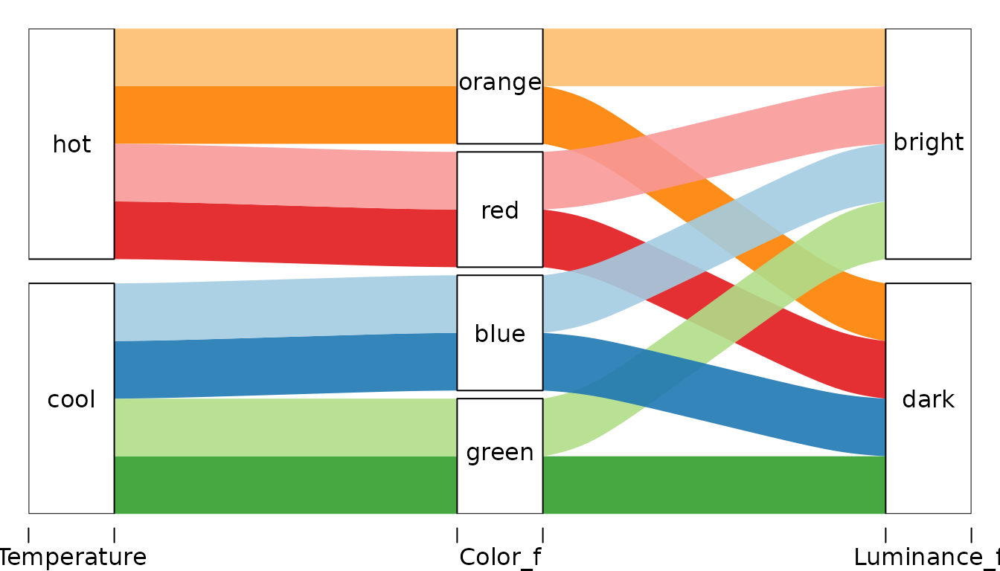

#### Adjusting vertical order of alluvia

**This feature is experimental!**

Usually the order of the variables (axes) is rather unimportant.
However, having particular two variables next to each other facilitates
analyzing dependency between those two variables. In alluvial diagrams
the ordering of the variables determines the vertical plotting order of
the alluvia. This vertical order, together with setting `blocks` to
`FALSE`, can be used to turn category blocks into stacked barcharts.

Consider two versions of subsets of the Titanic data that differ only in
the order of variables.

``` r

tit %>% group_by(Sex, Age, Survived) %>%
  summarise( n= sum(Freq)) -> x
```

    ## `summarise()` has regrouped the output.
    ## ℹ Summaries were computed grouped by Sex, Age, and Survived.
    ## ℹ Output is grouped by Sex and Age.
    ## ℹ Use `summarise(.groups = "drop_last")` to silence this message.
    ## ℹ Use `summarise(.by = c(Sex, Age, Survived))` for per-operation grouping
    ##   (`?dplyr::dplyr_by`) instead.

``` r

tit %>% group_by(Survived, Age, Sex) %>%
  summarise( n= sum(Freq)) -> y
```

    ## `summarise()` has regrouped the output.
    ## ℹ Summaries were computed grouped by Survived, Age, and Sex.
    ## ℹ Output is grouped by Survived and Age.
    ## ℹ Use `summarise(.groups = "drop_last")` to silence this message.
    ## ℹ Use `summarise(.by = c(Survived, Age, Sex))` for per-operation grouping
    ##   (`?dplyr::dplyr_by`) instead.

In `x` we have Sex-Age-Survived-n while in `y` we have
Survived-Age-Sex-n.

If we color the alluvia according to the first axis, the category blocks
of Age and Survived become barcharts showing relative frequencies of Men
and Women within categories of Age and Survived.

``` r

alluvial(x[,1:3], freq=x$n, 
         col = ifelse(x$Sex == "Male", "orange", "grey"),
         alpha = 0.8,
         blocks=FALSE
)
```

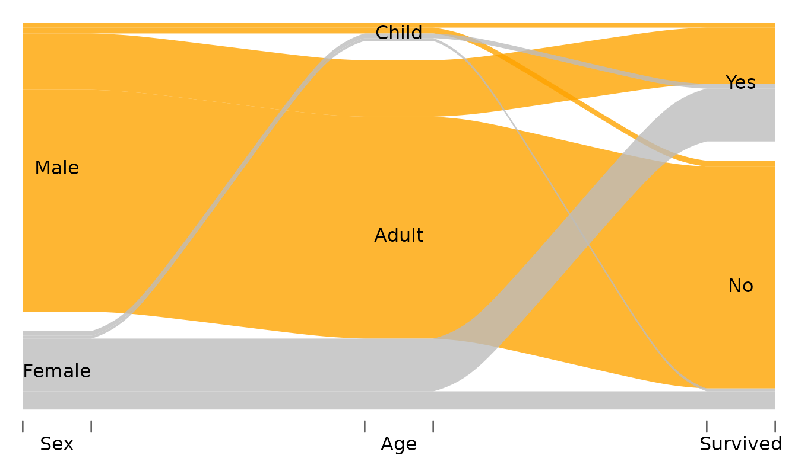

Now we can see for example that

- There were a little bit of more girls than boys (category
  `Age == "Child"`)
- Among surviors there were roughly the same number of Men and Women.

Argument `ordering` can be used to fully customize the ordering of each
alluvium on each axis without the need to reorder the axes themselves.
This feature is experimental as you can easily break things. It expects
a list of numeric vectors or `NULL`s one for each variable in the data:

- Value `NULL` does not change the default order on the corresponding
  axis.
- A numeric vector should have length equal to the number of rows in the
  data and is determines the vertical order of the alluvia on the
  corresponding axis.

For example:

``` r

alluvial(y[,1:3], freq=y$n, 
         # col = RColorBrewer::brewer.pal(8, "Set1"),
         col = ifelse(y$Sex == "Male", "orange", "grey"),
         alpha = 0.8,
         blocks = FALSE,
         ordering = list(
           order(y$Survived, y$Sex == "Male"),
           order(y$Age, y$Sex == "Male"),
           NULL
         )
)
```

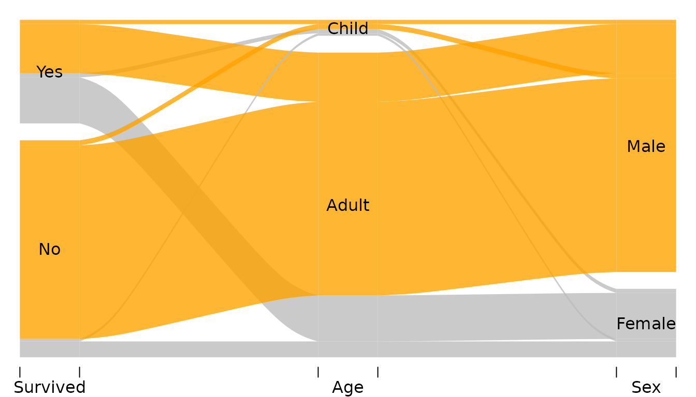

The list passed to `ordering` has has three elements corresponding to
`Survived`, `Age`, and `Sex` respectively (that’s the order of the
variables in `y`). The elements of this list are

1.  Call to `order` sorting the alluvia on the `Survived` axis. The
    alluvia need to be sorted according to `Survived` first (otherwise
    the categories “Yes” and “No” will be destroyed) and according to
    the `Sex` second.
2.  Call to `order` sorting the alluvia on the `Age` axis. The alluvia
    need to be sorted according to `Age` first `Sex` second.
3.  `NULL` leaves the default ordering on `Sex` axis.

In the example below alluvia are colored by sex (red=Female, blue=Male)
and survival status (bright=survived, dark=did not survive). Each
category block is a stacked barchart showing relative freuquencies of
man/women who did/did not survive. The alluvia are reordered on the last
axis (Age) so that Sex categories are next each other (red together and
blue together):

``` r

pal <- c("red4", "lightskyblue4", "red", "lightskyblue")

tit %>%
  mutate(
    ss = paste(Survived, Sex),
    k = pal[ match(ss, sort(unique(ss))) ]
  ) -> tit


alluvial(tit[,c(4,2,3)], freq=tit$Freq,
         hide = tit$Freq < 10,
         col = tit$k,
         border = tit$k,
         blocks=FALSE,
         ordering = list(
           NULL,
           NULL,
           order(tit$Age, tit$Sex )

         )
)
```

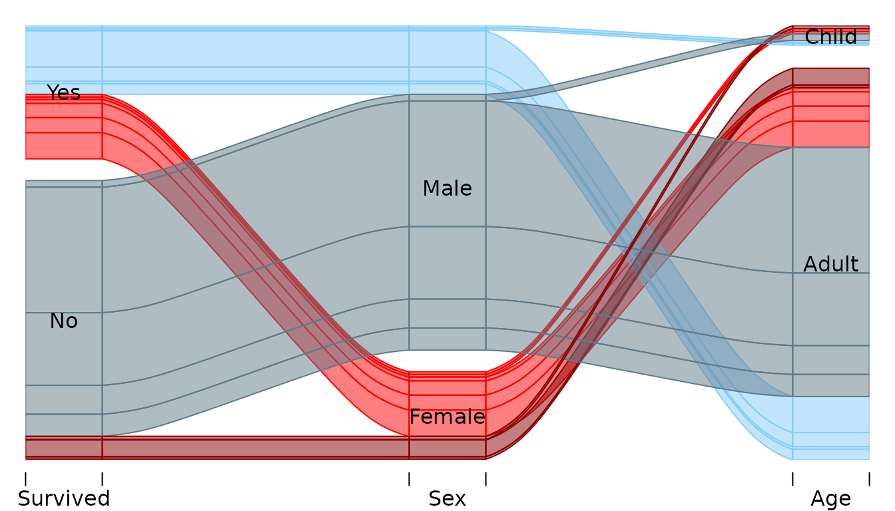

## Appendix

``` r

sessionInfo()
```

    ## R version 4.6.0 (2026-04-24)
    ## Platform: x86_64-pc-linux-gnu
    ## Running under: Ubuntu 24.04.4 LTS
    ## 
    ## Matrix products: default
    ## BLAS:   /usr/lib/x86_64-linux-gnu/openblas-pthread/libblas.so.3 
    ## LAPACK: /usr/lib/x86_64-linux-gnu/openblas-pthread/libopenblasp-r0.3.26.so;  LAPACK version 3.12.0
    ## 
    ## locale:
    ##  [1] LC_CTYPE=C.UTF-8       LC_NUMERIC=C           LC_TIME=C.UTF-8       
    ##  [4] LC_COLLATE=C.UTF-8     LC_MONETARY=C.UTF-8    LC_MESSAGES=C.UTF-8   
    ##  [7] LC_PAPER=C.UTF-8       LC_NAME=C              LC_ADDRESS=C          
    ## [10] LC_TELEPHONE=C         LC_MEASUREMENT=C.UTF-8 LC_IDENTIFICATION=C   
    ## 
    ## time zone: UTC
    ## tzcode source: system (glibc)
    ## 
    ## attached base packages:
    ## [1] stats     graphics  grDevices utils     datasets  methods   base     
    ## 
    ## other attached packages:
    ## [1] dplyr_1.2.1    alluvial_0.2-0
    ## 
    ## loaded via a namespace (and not attached):
    ##  [1] vctrs_0.7.3       cli_3.6.6         knitr_1.51        rlang_1.2.0      
    ##  [5] xfun_0.57         otel_0.2.0        purrr_1.2.2       generics_0.1.4   
    ##  [9] textshaping_1.0.5 jsonlite_2.0.0    glue_1.8.1        htmltools_0.5.9  
    ## [13] ragg_1.5.2        sass_0.4.10       rmarkdown_2.31    tibble_3.3.1     
    ## [17] evaluate_1.0.5    jquerylib_0.1.4   fastmap_1.2.0     yaml_2.3.12      
    ## [21] lifecycle_1.0.5   compiler_4.6.0    fs_2.1.0          pkgconfig_2.0.3  
    ## [25] htmlwidgets_1.6.4 tidyr_1.3.2       systemfonts_1.3.2 digest_0.6.39    
    ## [29] R6_2.6.1          utf8_1.2.6        tidyselect_1.2.1  pillar_1.11.1    
    ## [33] magrittr_2.0.5    bslib_0.10.0      withr_3.0.2       tools_4.6.0      
    ## [37] pkgdown_2.2.0     cachem_1.1.0      desc_1.4.3
